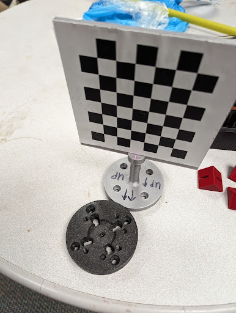
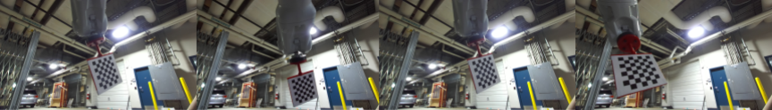
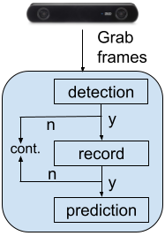
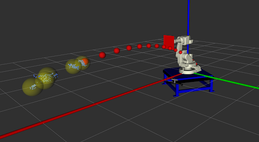

# shield_perception

## Dependencies

[ZED SDK](https://www.stereolabs.com/developers/release)\
[ROS](https://wiki.ros.org/) packages

## Hardware

StereoLabs ZED 2i Stereo Camera [[link]](https://www.stereolabs.com/products/zed-2)

## Calibration

**Requirements:** 3D print of camera calibration tool provided in `scripts/camera_calibration/calibration_tool`



We have an automated Hand-Eye calibration tool that finds the pose of the camera frame with respect to the base frame of the robot given an approximate initial pose. Using this approximate initial pose, we compute a Region of Interest (RoI). We use MuJoCo (included in this package) to model this RoI, sample poses from it. We then run IK to find a robot configuration to reach this pose such that the calibration tool is in the field of view of the camera and use a interpolator to command the robot to reach the configration. Once reached, we use the ZED SDK to save an image of the checkerboard pattern in the calibration tool. This data collected is used in the subsequent registration algorithm to find the pose of the camera frame from the base link.

To collect data for calibration, run
```bash
cd scripts
python camcalib.py
```
The collected data looks like 


To perform registration, run
```bash
cd scripts
python calibdata.py
```

**Note:** The interpolator used above for calibration does not perform collision checking!

## Perception Pipeline
The perception pipeline that runs online consists of two parts
1. The detection submodule which continuously scans the environment to detect an object being thrown at the robot
2. The prediction submodule that predicts the future motion of the object given a set of detected poses. 



### Ball Detection
The pipeline assumes a particular color of the ball and performs color filtering over every dataframe of the camera to detect the ball. If there is any activity, we retrieve their depth values from the pointcloud and check for outliers and reject them to ensure that no spurious activity is detected. This camera is set at 60fps @ 720p.

### Ball Prediction
For prediction, we use a simple parabolic projectile model assuming no air drag. To find the predicted trajectory of the ball, we run an optimization to minimize the Least Means Square (LMS) of the error between the observed data and the model.





To run the Perception Pipeline, first make sure that the `shield_planner` is running and connected to the robot and then run
```bash
cd scripts
python track_ball_sdk.py
```

The following parameters in the script needs to be tuned for every environment
```python
# Macro: 
# METHOD_ID: 0 = bounding box, 1 = color filtering
# NUM_FRAME: number of frames required to start estimation
# COLOR_FILTER: sets of color filtering in pc
## 0: nothing
## 1: lower = (160, 40, 40) upper = (250, 125, 125) - working, well?
# PRINT_COLOR: print out color's bound
# OUTLIER_REJECT: perform outlier reject or not
# PASSTHROUGH: Filter data (turn off perception) outside a virtual bounding box
METHOD_ID=0
NUM_FRAME=3
COLOR_FILTER=0
PRINT_COLOR=0
OUTLIER_REJECT=1
PASSTHROUGH = 0
```
