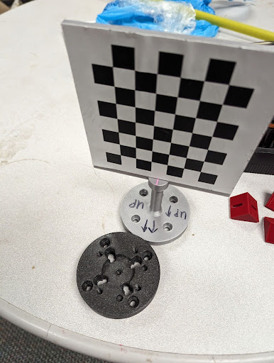
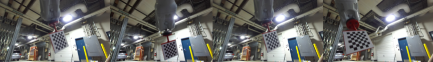

# shield_perception

ROS1 perception for detecting a thrown ball with a StereoLabs ZED 2i camera and
publishing its estimated 3D state and covariance.

> **Branch note:** On `gabe/demo`, the online perception pipeline is implemented
> in C++ rather than Python. YOLOv8 weights are exported from PyTorch to ONNX,
> compiled into a TensorRT engine, and loaded by the C++ tracking node.

The older Python tracking scripts remain in `scripts/` as development references,
but the supported online entry point for this branch is:

```text
track_ball_meancovariance_node
```

## Pipeline overview

The C++ node performs the complete online pipeline in one process:

1. Opens a live ZED 2i camera or an SVO recording through the ZED SDK.
2. Retrieves the left RGB image and registered XYZ point cloud.
3. Runs YOLOv8 ball detection using TensorRT.
4. Shrinks the detected bounding box and collects its valid 3D points.
5. Transforms those points from the ZED left-camera frame into the robot base
   frame using the hand-eye calibration matrix in `params/zed2i.yaml`.
6. Rejects workspace and statistical outliers.
7. Estimates the projectile position, velocity, and covariance with a sliding
   Kalman filter.
8. Publishes `shield_planner_msgs/MeanCovariance` on `/projectile`.

The published state is ordered as:

```text
mu = [x, y, z, vx, vy, vz]
```

The 6-by-6 covariance is flattened in row-major order into `P`. Messages use
`odom_combined` as their `header.frame_id`.

## Hardware

- StereoLabs ZED 2i stereo camera
- CUDA-capable NVIDIA GPU
- ABB robot and calibration tool for hand-eye calibration

## Dependencies

- ROS1 and catkin
- `shield_planner_msgs`
- [ZED SDK](https://www.stereolabs.com/developers/release), including the C++
  headers and `libsl_zed`
- NVIDIA CUDA
- NVIDIA TensorRT and the TensorRT ONNX parser
- OpenCV
- Eigen3
- Python calibration dependencies used by `camcalib.py` and `calibdata.py`
- MuJoCo, included under `third_party/`, for calibration pose sampling

The package's CMake configuration searches common ZED, CUDA, and TensorRT
installation paths. Configuration stops with an error if their required headers
or libraries cannot be found.

## Camera calibration

Calibration estimates the pose of the ZED left-camera frame relative to the
robot base frame. Recalibrate whenever the camera or its mounting bracket moves.

### Requirements

Use the 3D-printable camera calibration tool provided in:

```text
scripts/camera_calibration/calibration_tool/
```



The automated hand-eye calibration procedure starts from an approximate camera
pose and constructs a region of interest. MuJoCo samples calibration-tool poses
inside this region, inverse kinematics finds corresponding robot configurations,
and an interpolator moves the robot to each configuration. At each pose, the ZED
SDK records an image of the checkerboard and the corresponding robot pose.
`calibdata.py` then registers the collected camera and robot measurements to
estimate the camera extrinsic transform.

> **Safety warning:** The calibration interpolator does not perform collision
> checking. Clear the robot workspace, remove the shield, install the calibration
> end-effector attachment, and follow the laboratory's robot-safety procedure.

### 1. Collect calibration data

Start the ABB robot interface and controller, place the robot in the required
initial configuration, and then run:

```bash
cd ~/code/shield_replan_ws/src/shield_perception/scripts
python camcalib.py
```

The collected data should resemble:



### 2. Compute the registration

From the same directory, run:

```bash
python calibdata.py
```

The script prints the estimated camera transforms, including the transform used
to convert ZED left-camera points into the robot base frame.

### 3. Copy the calibrated transform into `zed2i.yaml`

**Calibration does not automatically update the online C++ node's parameters.**
After running `camcalib.py` and `calibdata.py`, the developer must copy the new
4-by-4 `T_BASE_TO_LEFT` matrix into:

```text
params/zed2i.yaml
```

Paste it under `track_ball_meancovariance.base_to_left` as 16 **row-major**
values. For example:

```yaml
track_ball_meancovariance:
    base_to_left: [r00, r01, r02, tx,
                   r10, r11, r12, ty,
                   r20, r21, r22, tz,
                   0.0, 0.0, 0.0, 1.0]
```

The translation must be expressed in meters, matching the ZED runtime's
`sl::UNIT::METER` setting.

The launch file loads this matrix as the private ROS parameter
`/track_ball_meancovariance/base_to_left`. The node validates that it has 16
finite values, a valid rotation block, and the homogeneous last row
`[0, 0, 0, 1]`. It exits with a fatal error if the matrix is missing or invalid.

Because the matrix is now loaded at runtime, updating `zed2i.yaml` does not
require recompiling the C++ node. Restart the perception launch after changing
the file.

## YOLO model and TensorRT engine

The relevant model artifacts are stored in `scripts/`:

```text
YOLOv8_weights_2.pt             trained PyTorch/Ultralytics model
YOLOv8_weights_2.onnx           exported ONNX graph
YOLOv8_weights_2.engine         generated TensorRT engine
YOLOv8_weights_2_trt86.engine   engine generated for the demo environment
```

The online C++ node loads a TensorRT `.engine` file. It does not load `.pt` or
`.onnx` files directly.

> TensorRT engines are environment-specific. Rebuild the engine when changing
> the GPU, TensorRT version, or CUDA version, or when engine deserialization
> fails on another workstation.

### Export PyTorch weights to ONNX

Export the trained model using Ultralytics YOLO. Preserve the model's static
image size because the C++ runtime currently requires a static CHW input shape.

```bash
yolo export \
  model=src/shield_perception/scripts/YOLOv8_weights_2.pt \
  format=onnx \
  imgsz=<training-image-size>
```

When regenerating the model, record the exact Ultralytics version, image size,
ONNX opset, and export options used. The current repository does not preserve
the exact command that produced the checked-in ONNX file.

The runtime expects one image input, one output tensor, and YOLOv8-style
detection output.

### Build a TensorRT engine

Two ONNX-to-engine utilities are provided.

For TensorRT 8, build the package and use the C++ utility:

```bash
cd ~/code/shield_replan_ws
catkin build shield_perception
source devel/setup.bash

rosrun shield_perception build_tensorrt_engine_trt8 \
  "$(rospack find shield_perception)/scripts/YOLOv8_weights_2.onnx" \
  "$(rospack find shield_perception)/scripts/YOLOv8_weights_2.engine" \
  4096 \
  --fp16
```

For TensorRT 10/11, use the Python utility from an environment containing the
TensorRT Python module:

```bash
python3 "$(rospack find shield_perception)/scripts/build_tensorrt_engine.py" \
  "$(rospack find shield_perception)/scripts/YOLOv8_weights_2.onnx" \
  --engine "$(rospack find shield_perception)/scripts/YOLOv8_weights_2.engine" \
  --workspace-gb 4 \
  --fp16
```

After building an engine, set `engine_path` in
`params/track_ball_meancovariance.yaml` to the generated file.

## Build

From the catkin workspace root:

```bash
cd ~/code/shield_replan_ws
catkin build shield_perception
source devel/setup.bash
```

The package builds:

```text
track_ball_meancovariance_node  online C++ perception node
build_tensorrt_engine_trt8      TensorRT 8 ONNX-to-engine utility
```

## Run

Connect the ZED camera, verify that `engine_path` points to a compatible
TensorRT engine, and start perception:

```bash
cd ~/code/shield_replan_ws
source devel/setup.bash
roslaunch shield_perception track_ball_meancovariance.launch
```

The launch file loads both:

```text
params/zed2i.yaml
params/track_ball_meancovariance.yaml
```

It then starts `/track_ball_meancovariance`.

## ROS interface

### Published topic

| Topic | Message type | Description |
| --- | --- | --- |
| `/projectile` | `shield_planner_msgs/MeanCovariance` | Estimated 6D projectile state and 6-by-6 covariance |

The node does not subscribe to an image topic. It opens the ZED camera directly
through the ZED SDK.

## Parameters

Tracking parameters are in `params/track_ball_meancovariance.yaml`. Camera and
calibration parameters are in `params/zed2i.yaml`.

| Parameter | Default | Description |
| --- | ---: | --- |
| `engine_path` | workstation-specific path | TensorRT engine loaded at startup |
| `confidence_threshold` | `0.3` | Minimum accepted YOLO confidence |
| `use_letterbox` | `true` | Preserve aspect ratio during model preprocessing |
| `dist_threshold` | `9.0` | Maximum accepted transformed point distance in meters |
| `min_pixel` | `30` | Minimum valid 3D points required for a measurement |
| `num_frame` | `4` | Sliding estimator window; values below 3 are raised to 3 |
| `camera_resolution` | `VGA` | `HD720` is supported explicitly; other values select VGA |
| `camera_fps` | `100` | Requested ZED frame rate |
| `svo_file` | empty | Optional SVO recording path instead of a live camera |
| `debug_log` | `false` | Enable throttled detection and estimation diagnostics |
| `debug_image_path` | empty | Save the first RGB frame when a path is supplied |
| `base_to_left` | calibrated 4-by-4 matrix | Row-major ZED-left-camera to robot-base transform |

The node clears its estimator after five consecutive frames without a usable
detection. It begins estimating after `num_frame` valid measurements and only
publishes when the current hard-coded gate `abs(vx) > 2.0 m/s` is satisfied.

## Test with a recorded SVO

To use a ZED recording instead of the live camera, set an absolute SVO path in
`params/track_ball_meancovariance.yaml`:

```yaml
svo_file: "/absolute/path/to/recording.svo"
```

Then launch the node normally.

## Troubleshooting

### ZED SDK is not found during configuration

Confirm that the SDK provides `sl/Camera.hpp` and `libsl_zed`. The default CMake
search paths include `/usr/local/zed/include` and `/usr/local/zed/lib`.

### TensorRT or CUDA is not found

Confirm that TensorRT headers, `libnvinfer`, `libnvonnxparser`, CUDA headers, and
`libcudart` are installed. Supply the corresponding CMake paths explicitly if
they are installed outside the searched locations.

### The engine cannot be deserialized

Rebuild it from `YOLOv8_weights_2.onnx` on the target workstation. The checked-in
engine may have been produced with a different GPU, CUDA version, or TensorRT
version.

### The node starts but `/projectile` is silent

Enable diagnostics:

```yaml
debug_log: true
```

Then check that:

- the ZED camera opens at the requested resolution and frame rate;
- the configured engine matches the exported model;
- YOLO detects the ball above `confidence_threshold`;
- at least `min_pixel` valid depth samples survive filtering;
- `base_to_left` contains the latest calibration result;
- `num_frame` valid measurements have accumulated; and
- the estimated `abs(vx)` exceeds `2.0 m/s`.

Useful ROS commands include:

```bash
rostopic echo /projectile
rosparam get /track_ball_meancovariance
```

## Source map

```text
src/track_ball_meancovariance_node.cpp
    Active ZED, TensorRT, filtering, and state-estimation node

src/build_tensorrt_engine_trt8.cpp
    TensorRT 8 ONNX-to-engine utility

scripts/build_tensorrt_engine.py
    TensorRT 10/11 ONNX-to-engine utility

launch/track_ball_meancovariance.launch
    Active perception launch file

params/track_ball_meancovariance.yaml
    Detector, estimator, engine, debug, and input settings

params/zed2i.yaml
    ZED settings and calibrated base-to-left-camera transform

scripts/camcalib.py
    Automated calibration data collection

scripts/calibdata.py
    Hand-eye registration and transform calculation

scripts/track_ball_sdk_meancovariance.py
    Earlier Python implementation retained as a reference
```
